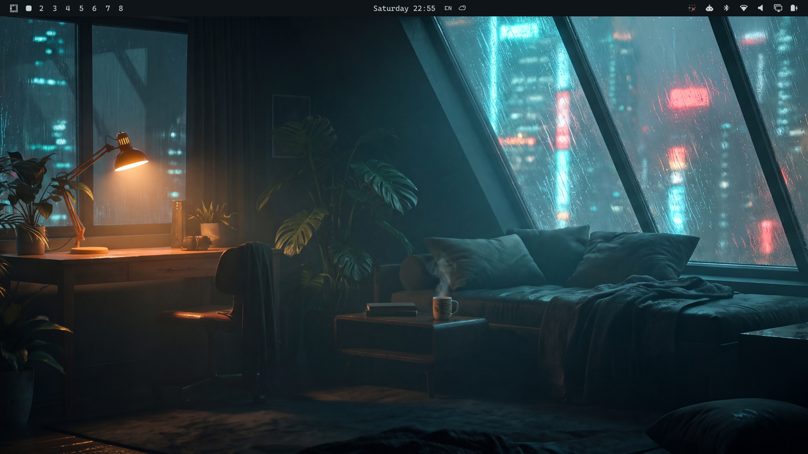
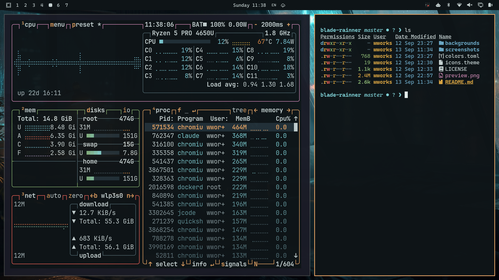

# Blade Rainner

Inspired by a love for Blade Runner, and by the visuals and music of
[SpaceWave](https://www.youtube.com/@spacewavecr), a great ambient music
composer.





Blade Rainner is a dark theme for [Omarchy](https://omarchy.org). It takes its
mood from rainy cyberpunk cityscapes: near-black wet asphalt, teal fog in the
middle distance, and a single amber lamp burning in it. Dystopian, but cozy.

## Why

I love these visuals while I work. They keep me in focus, and they keep things
cozy. Cyberpunk is my favourite science fiction look in general: moody, rainy,
and warm at the same time.

I listen to rain sounds and to the ambient music of
[SpaceWave](https://www.youtube.com/@spacewavecr) while I work. I recommend you
try it.

## Install

```bash
omarchy theme install https://github.com/yumhum/omarchy-blade-rainner-theme
omarchy theme set "Blade Rainner"
```

## Palette

| Role | Colour | |
|---|---|---|
| Accent | `#e0a062` | warm lamp |
| Background | `#0e1417` | wet asphalt at night |
| Foreground | `#c6d2d2` | fog grey |
| Selection | `#223038` | |
| Muted | `#4a5f66` | |
| Red | `#e05c52` | neon sign |
| Orange | `#e08a4a` | |
| Yellow | `#d9a441` | |
| Green | `#7fa66a` | balcony foliage |
| Cyan | `#7ecfd4` | store front glow |
| Blue | `#6aa7c4` | |
| Magenta | `#c07fa8` | |
| Brown | `#8a6b52` | |

Icons use `Yaru-prussiangreen`.

## Backgrounds

Eight wallpapers at 3440x1440, all in the theme palette:

| | |
|---|---|
| `1-midnight-market` | A convenience store at 3am in the rain |
| `2-balcony-garden` | Looking down on the neon city through ferns |
| `3-kaizora-apartment` | One warm lamp, one cold window |
| `4-weary-runner` | A figure, a heater, and a long view |
| `5-the-pyramid` | A lit megastructure in low fog |
| `6-wet-alley` | Lanterns, plants, and standing water |
| `7-spinner-sprawl` | A flying car over an endless skyline |
| `8-mesa-station` | A lone structure on a fogged ridge |

They were generated from SpaceWave stills as colour and mood references, then
graded to the palette above.

Cycle them with `omarchy theme bg next`. Add your own to `backgrounds/`, or to
`~/.config/omarchy/backgrounds/blade-rainner/`.

## Recommended font

CaskaydiaMono Nerd Font. It is rounded and soft, which suits the warm half of
the theme, and it carries the glyphs the Omarchy bar needs.

```bash
omarchy font set "CaskaydiaMono Nerd Font"
```

Font size is not part of a theme. Set it in your terminal config.

## License

MIT. See [LICENSE](LICENSE).
